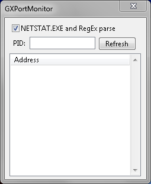
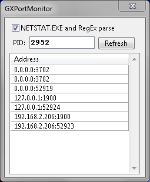

# GXPortMonitor

## Description

(Only Windows platform)

Free software that allows you to monitor server ports of any game.

Writed by using [U++](https://www.ultimatepp.org) library and Win32 IP Helper ([iphlpapi.h](https://docs.microsoft.com/en-us/windows/win32/api/iphlpapi/)).

### TODO

1. Open project directory
2. Open `Build` folder
3. Run `GXPortMonitor.exe`
4. Specify PID of target process
5. Make sure RegEx mode is checked
6. Press `Refresh` button
7. Look for the right port
8. Done.

## Authors

* **Andrii Bondarenko** - [PraydE](https://github.com/PraydE007)

